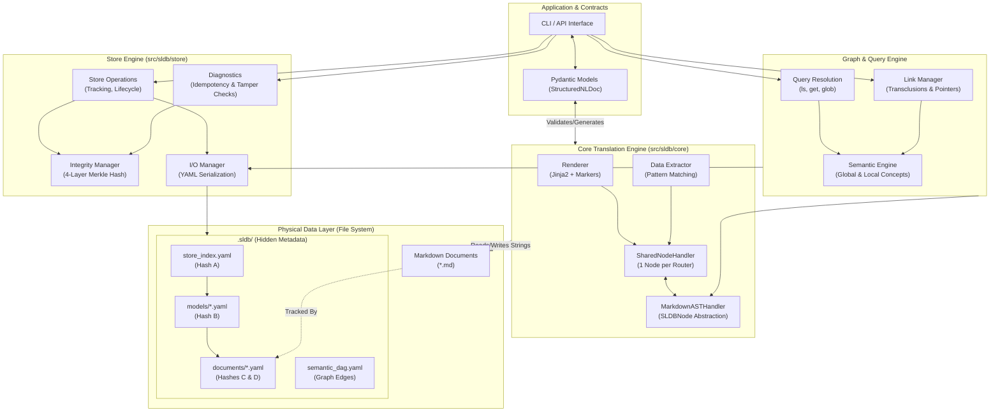

# SLDB Holistic Database Architecture

This diagram illustrates the complete architecture of the Structured Language Database (SLDB). It maps the journey of data from high-level Python contracts down to the persistent physical file system, highlighting the extraction, integrity (Merkle hashing), and graph connection layers.

### Component Highlights

1. **Application & Contracts**: The user interacts with the database purely through typed Pydantic models (`StructuredNLDoc`). The system enforces these shapes.
2. **Core Translation Engine**: Responsible for the bidirectional translation. It guarantees that `Markdown -> Object -> Markdown` is perfectly idempotent. The `SharedNodeHandler` routes every AST node (`SLDBNode`) to specialized extractors (lists, tables, YAML), supporting infinitely nested structures.
3. **Graph & Query Engine**: Elevates flat files into a knowledge graph. It resolves semantic links, manages transclusions (composing larger documents from smaller ones), and maintains local vs. global semantic boundaries.
4. **Store Engine**: The database manager. It tracks documents and calculates a 4-layer Merkle-style hash cascade (Hash A, B, C, D) to detect tampering, content drift, or model schema changes.
5. **Physical Data Layer**: The actual storage mechanism. Content is stored as plain, portable `.md` files. Metadata (hashes, schema references, graph edges) is strictly isolated in the `.sldb/` folder, allowing the Markdown to remain fully independent of the database tooling if needed.
