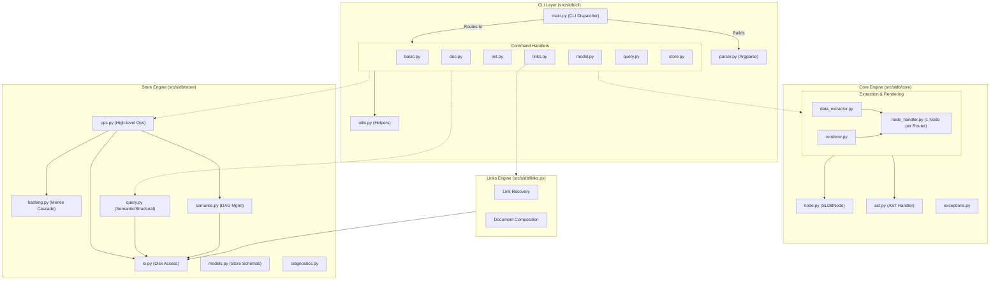

# SLDB Refactored Component Diagram

This document contains a visual representation of the SLDB architecture following the modularity refactoring, demonstrating the separation of concerns and clear dependencies between the CLI, the Store engine, and the Core extraction/rendering layers.

